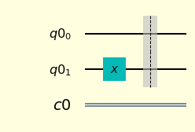
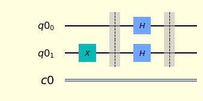
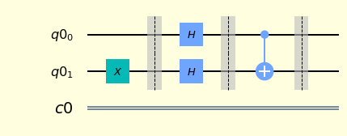
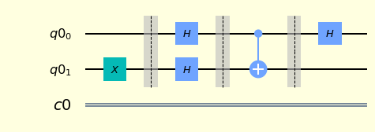
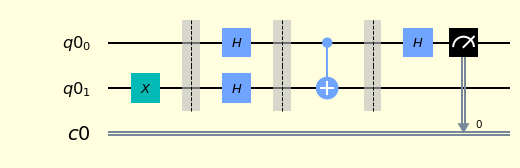
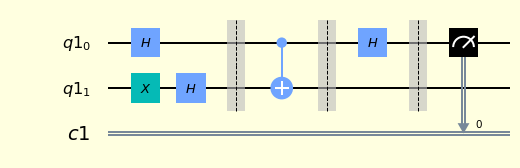
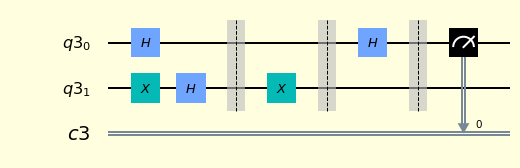
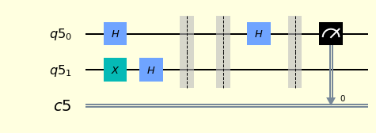
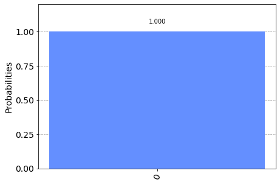

# The Deutsch Algorithm 

### Victor Onofre


```python
from qiskit import QuantumCircuit, QuantumRegister, ClassicalRegister, execute, Aer, IBMQ, BasicAer
from qiskit.visualization import plot_bloch_multivector,plot_bloch_vector, plot_histogram
from qiskit.quantum_info import Statevector
import numpy as np 
import matplotlib
```

The QasmSimulator backend is designed to mimic an actual device. It executes a Qiskit QuantumCircuit and returns a count dictionary containing the final values of any classical registers in the circuit.


```python
backend = BasicAer.get_backend('qasm_simulator')
shots = 1024
```


```python
style = {'backgroundcolor': 'lightyellow'} # Style of the circuits
```

The problem solved by the Deutsch algorithm is the following. We are given a device that computes some function $f: \{0,1 \} \rightarrow \{0,1\}$. We can think of the device as a black box or "oracle".This means that we can apply the circuit to obtain values of $f(x)$ for given inputs $x$, but we cannot gain any information about the inner workings of the circuit to learn about the function $f$. There are 4 possible funcions from $\{0,1 \}$ to $\{0,1\}$, $f_{0}$, $f_{1}$, $f_{2}$ and $f_{3}$.

**$f(x)$ is constant $\Big( f_{i}(0) = f_{i}(1) \Big)$ or balanced $\Big(  f_{i}(0) \neq f_{i}(1) \Big) $?**

| Function $f_{i}(x)$  &nbsp; &nbsp; &nbsp; |  $x = 0$       &nbsp; &nbsp; &nbsp; &nbsp; &nbsp; &nbsp; &nbsp; &nbsp; &nbsp;     | $x =1$    &nbsp; &nbsp; &nbsp; &nbsp; &nbsp; &nbsp; &nbsp; &nbsp; &nbsp;               | $f_{i}(0) \oplus    f_{i}(1)$     &nbsp; &nbsp; &nbsp; &nbsp; &nbsp; &nbsp; &nbsp; &nbsp; &nbsp; &nbsp; &nbsp; &nbsp;  &nbsp; &nbsp; &nbsp;        |
|:------------------------:|:--------------------:|:----------------------:|:----------------------------------------------:|
|          $f_{0}$         |           0          |            0           |                        0                       |
|          $f_{1}$         |           0          |            1           |                        1                       |
|          $f_{2}$         |           1          |            0           |                        1                       |
|          $f_{3}$         |           1          |            1           |                        0                       ||

The problem is to determine the value of $f_{i}(0) \oplus  f_{i}(1)$. If we determine that $f(0) \oplus f(1) = 0$, then we known that $f$ is constant $\Big( f(0) = f(1) \Big) $. If  $f(0) \oplus f(1) = 1$  then we known that $f$ is balanced $\Big(  f(0) \neq f(1) \Big) $. In particular $f_{0}$ and $f_{3}$ are constant and $f_{1}$ and $f_{2}$ are balanced.

Classically, **two** evaluations or query of the function are necessary to answer the question. If only one evaluation is permitted, the function could still be either constant or balanced regardless of the input and output obtained.

The Deutsch algorithm is a quantum algorithm capable of determining the value of $f_{i}(0) \oplus  f_{i}(1)$ by making only a single query to a quantum oracle for $f$.

The oracle can be expressed as a unitary operator

$$ U_{f} \vert  x\rangle_{A}  \vert  y \rangle_{B} =  \vert  x \rangle_{A} \vert y \oplus f(x) \rangle_{B} $$


```python
qreg1 = QuantumRegister(2)
register1 = ClassicalRegister(1) 

qc = QuantumCircuit(qreg1, register1)
```

## Initial state


```python
#qc.x(0)
qc.x(1)
qc.barrier()
qc.draw(output='mpl', style=style) 
```





The initial stae is $ \vert 0 \rangle \vert 0 \rangle$, we apply the $x$ gate to the second qubit and obtain $ \vert \psi_{0} \rangle =  \vert 0 \rangle \vert 1 \rangle$

$$ \vert \psi_{0}  \rangle_{AB} =  \vert 0  \rangle_{A} X \vert 0  \rangle_{B}=  \vert 0  \rangle_{A} \vert 1 \rangle_{B} $$

## Apply Hadamard gates


```python
qc.h(0)
qc.h(1)
qc.barrier()
qc.draw(output='mpl', style=style) 
```





After the Hadamard gate is apply to $\vert \psi_{0} \rangle_{AB}$, the state becomes

$$ \vert \psi_{1} \rangle_{AB} = (H \otimes H) \vert \psi_{0} \rangle_{AB} = H \vert 0 \rangle_{A} H \vert 1 \rangle_{B}= \Big( \frac{1}{\sqrt{2}} \vert 0 \rangle_{A} + \frac{1}{\sqrt{2}} \vert 1 \rangle_{A} \Big) \Big( \frac{1}{\sqrt{2}} \vert 0 \rangle_{B}  - \frac{1}{\sqrt{2}} \vert 1 \rangle_{B} \Big)$$

$$ =  \frac{1}{2} \vert 0 \rangle_{A} \Big(   \vert 0 \rangle_{B} -  \vert 1 \rangle_{B} \Big)  +  \frac{1}{2} \vert 1 \rangle_{A} \Big(  \vert 0 \rangle_{B} -  \vert 1 \rangle_{B} \Big)  $$

## Oracle $U_{f}$

Applying the $U_{f}$ oracle, we have the state:

$$ \vert \psi_{2} \rangle_{AB}  = U_{f} \vert \psi_{1} \rangle_{AB}  =  \frac{1}{2} \vert 0 \rangle_{A}  \Big(  \vert 0 \oplus f(0) \rangle_{B} -  \vert 1 \oplus f(0) \rangle_{B} \Big)  +  \frac{1}{2} \vert 1 \rangle_{A}  \Big( \vert 0 \oplus f(1)\rangle_{B} -  \vert 1 \oplus f(1)  \rangle_{B} \Big)  $$

Using $ \vert 0 \oplus a \rangle -  \vert 1 \oplus a \rangle = (-1)^{a} (\vert  0 \rangle - \vert 1 \rangle ) $

$$  \vert \psi_{2}\rangle_{AB}  =  \frac{1}{2} (-1)^{f(0)} \vert 0 \rangle_{A}  \Big( \vert 0 \rangle_{B} - \vert 1 \rangle_{B} \Big)  +  \frac{1}{2} (-1)^{f(1)} \vert 1 \rangle_{A} \Big( \vert 0 \rangle_{B} -  \vert 1 \rangle_{B} \Big)  =  \Big( \frac{1}{\sqrt{2}} (-1)^{f(0)} \vert 0 \rangle_{A}  +   \frac{1}{\sqrt{2}} (-1)^{f(1)} \vert 1 \rangle_{A}  \Big)  \Big( \frac{1}{\sqrt{2}} \vert 0 \rangle_{B} - \frac{1}{\sqrt{2}}\vert 1 \rangle_{B} \Big)  $$


$$  =  (-1)^{f(0)} \Big( \frac{1}{\sqrt{2}}  \vert 0 \rangle_{A}  +   \frac{1}{\sqrt{2}} (-1)^{f(0) \oplus f(1)} \vert 1 \rangle_{A}  \Big)  \Big( \frac{1}{\sqrt{2}} \vert 0 \rangle_{B} - \frac{1}{\sqrt{2}}\vert 1 \rangle_{B} \Big)  $$

## Function f(x) constant

If $U_{f}$ is constant $f(0) \oplus f(1) = 0$ then

$$ \vert \psi_{2} \rangle_{AB}  =  (-1)^{f(0)} \Big( \frac{1}{\sqrt{2}}  \vert 0 \rangle_{A}  +   \frac{1}{\sqrt{2}} (-1)^{0} \vert 1 \rangle_{A}  \Big) \Big( \frac{1}{\sqrt{2}}\vert 0 \rangle_{B} - \frac{1}{\sqrt{2}}\vert 1 \rangle_{B} \Big)  =  (-1)^{f(0)} \Big( \frac{1}{\sqrt{2}}  \vert 0 \rangle_{A}  +   \frac{1}{\sqrt{2}} \vert 1 \rangle_{A}  \Big) \Big( \frac{1}{\sqrt{2}}\vert 0 \rangle_{B} - \frac{1}{\sqrt{2}}\vert 1 \rangle_{B} \Big)  $$

Applying the Hadamard gate to the first ($A$) qubit 

$$  \vert \psi_{3} \rangle_{AB} =  (-1)^{f(0)} \Big( \frac{1}{\sqrt{2}}  H \vert 0 \rangle_{A}  +   \frac{1}{\sqrt{2}} H \vert 1 \rangle_{A}  \Big) \Big( \frac{1}{\sqrt{2}} \vert 0 \rangle_{B} - \frac{1}{\sqrt{2}} \vert 1 \rangle_{B} \Big)  $$

$$  =  (-1)^{f(0)} \Big[ \frac{1}{\sqrt{2}} \Big(  \frac{1}{\sqrt{2}} \vert 0 \rangle_{A} + \frac{1}{\sqrt{2}}\vert 1 \rangle_{A} \Big)  +   \frac{1}{\sqrt{2}} \Big( \frac{1}{\sqrt{2}} \vert 0\rangle_{A} - \frac{1}{\sqrt{2}} \vert 1\rangle_{A} \Big)  \Big] \Big( \frac{1}{\sqrt{2}}\vert 0 \rangle_{B} - \frac{1}{\sqrt{2}} \vert 1 \rangle_{B} \Big)  $$

$$  =  (-1)^{f(0)} \Big[  \Big(  \frac{1}{2} \vert  0 \rangle_{A} + \frac{1}{2} \vert 1 \rangle_{A} \Big)  +  \Big( \frac{1}{2} \vert  0 \rangle_{A} - \frac{1}{2} \vert  1 \rangle_{A} \Big)  \Big] \Big( \frac{1}{\sqrt{2}} \vert  0 \rangle_{B} - \frac{1}{\sqrt{2}} \vert  1 \rangle_{B} \Big)  $$

$$  =  (-1)^{f(0)} \vert  0 \rangle_{A} \Big( \frac{1}{\sqrt{2}} \vert  0\rangle_{B} - \frac{1}{\sqrt{2}} \vert  1\rangle_{B} \Big)  $$

The probability of measure $\vert 0  \rangle_{A}$ in the first qubit is 1. This means that for a **constant** function, a measurement of the first qubit is certain to return $\vert 0  \rangle$

## Function f(x) balanced

If $U_{f}$ is balance $f(0) \oplus f(1) = 1$ then

$$ \vert \psi_{2}>_{AB}  =  (-1)^{f(0)} \Big( \frac{1}{\sqrt{2}}  \vert 0 \rangle_{A}  +   \frac{1}{\sqrt{2}} (-1)^{1} \vert 1 \rangle_{A}  \Big) \Big( \frac{1}{\sqrt{2}}\vert 0 \rangle_{B} - \frac{1}{\sqrt{2}}\vert 1 \rangle_{B} \Big) $$

$$  =  (-1)^{f(0)} \Big( \frac{1}{\sqrt{2}}  \vert 0 \rangle_{A}  -  \frac{1}{\sqrt{2}} \vert 1 \rangle_{A}   \Big) \Big( \frac{1}{\sqrt{2}}\vert 0 \rangle_{B}  - \frac{1}{\sqrt{2}}\vert 1 \rangle_{B}  \Big)  $$

Apply the Hadamard gate to the first ($A$) qubit

$$  \vert \psi_{3}>_{AB}  =  (-1)^{f(0)} \Big( \frac{1}{\sqrt{2}}  H \vert  0 \rangle_{A}  -   \frac{1}{\sqrt{2}} H \vert 1 \rangle_{A}  \Big) \Big( \frac{1}{\sqrt{2}} \vert  0 \rangle_{B} - \frac{1}{\sqrt{2}} \vert  1 \rangle_{B} \Big)  $$

$$  =  (-1)^{f(0)} \Big[ \frac{1}{\sqrt{2}} \Big(  \frac{1}{\sqrt{2}}\vert  0 \rangle_{A} + \frac{1}{\sqrt{2}}\vert  1 \rangle_{A} \Big)  -  \frac{1}{\sqrt{2}} \Big( \frac{1}{\sqrt{2}}\vert  0 \rangle_{A} - \frac{1}{\sqrt{2}} \vert  1 \rangle_{A} \Big)  \Big] \Big( \frac{1}{\sqrt{2}}\vert  0 \rangle_{B} - \frac{1}{\sqrt{2}}\vert  1 \rangle_{B} \Big)  $$

$$  =  (-1)^{f(0)} \Big[  \Big(  \frac{1}{2} \vert 0 \rangle_{A} + \frac{1}{2} \vert 1 \rangle_{A} \Big)  -  \Big( \frac{1}{2} \vert 0 \rangle_{A} - \frac{1}{2} \vert 1 \rangle_{A} \Big)  \Big] \Big( \frac{1}{\sqrt{2}} \vert 0 \rangle_{B} - \frac{1}{\sqrt{2}} \vert 1 \rangle_{B} \Big)  $$

$$  =  (-1)^{f(0)} \vert 1 \rangle_{A} \Big( \frac{1}{\sqrt{2}}\vert 0 \rangle_{B} - \frac{1}{\sqrt{2}} \vert 1 \rangle_{B} \Big)  $$

The probability of measure $\vert 1  \rangle_{A}$ in the first qubit is 1. This means that for a **balanced** function, a measurement of the first qubit is certain to return $\vert 1  \rangle$

## Implemented a balanced oracle (CNOT)

In this case, we can implement the CNOT gate as a balanced oracle. 

$$U_{f} \vert 0 0 \rangle =  CNOT \vert 0 0 \rangle = \vert 0 0 \rangle  $$

$$U_{f} \vert 0 1 \rangle =  CNOT \vert 0 1 \rangle = \vert 0 1 \rangle  $$

$$U_{f} \vert 1 0 \rangle =  CNOT \vert  1 0 \rangle = \vert 1 1 \rangle  $$

$$U_{f} \vert 1 1 \rangle =  CNOT \vert 1 1 \rangle = \vert 1 0 \rangle  $$

The initial state can be described as:

$$ \vert \psi_{1} \rangle_{AB} = (H \otimes H) \vert \psi_{0} \rangle_{AB} = H \vert 0 \rangle_{A} H \vert 1 \rangle_{B}= \Big( \frac{1}{\sqrt{2}} \vert 0 \rangle_{A} + \frac{1}{\sqrt{2}} \vert 1 \rangle_{A} \Big) \Big( \frac{1}{\sqrt{2}} \vert 0 \rangle_{B}  - \frac{1}{\sqrt{2}} \vert 1 \rangle_{B} \Big) =  \vert + \rangle_{A}   \vert -\rangle_{B}  =  \vert + -\rangle_{AB} $$

where 

$$ \vert + \rangle  =  \frac{1}{\sqrt{2}} \vert 0 \rangle + \frac{1}{\sqrt{2}} \vert 1 \rangle  $$

$$ \vert - \rangle  =  \frac{1}{\sqrt{2}} \vert 0 \rangle - \frac{1}{\sqrt{2}} \vert 1 \rangle  $$

$$ \vert \psi_{1} \rangle_{AB} =  \frac{1}{2} \vert 0 \rangle_{A} \Big(   \vert 0 \rangle_{B} -  \vert 1 \rangle_{B} \Big)  +  \frac{1}{2} \vert 1 \rangle_{A} \Big(  \vert 0 \rangle_{B} -  \vert 1 \rangle_{B} \Big)  $$

$$ \vert \psi_{1} \rangle_{AB} =  \frac{1}{2} \Big(  \vert 0 0 \rangle - \vert 0 1 \rangle + \vert 1 0 \rangle - \vert 1 1 \rangle \Big)  $$


```python
qc.cx(0,1)
qc.barrier()
qc.draw(output='mpl', style=style) 
```





$$  \vert \psi_{2} \rangle_{AB}  = CNOT \vert \psi_{1} \rangle_{AB} =  \frac{1}{2} \Big(  \vert 0 0 \rangle - \vert 0 1 \rangle + \vert 1 1 \rangle - \vert 1 0 \rangle \Big)= \vert -  \rangle_{A} \vert - \rangle_{B}    = \vert - - \rangle_{AB}   $$

## Apply the Hadamard gate to the first ($A$) qubit


```python
qc.h(0)
qc.draw(output='mpl', style=style) 
```



$$  \vert \psi_{3} \rangle_{AB}  = (H \otimes I ) \vert \psi_{2} \rangle_{AB} =   (H\vert -  \rangle_{A}) \vert - \rangle_{B}   = \vert 1  \rangle_{A} \vert - \rangle_{B}   $$

The probability of measure $\vert 1  \rangle_{A}$ in the first qubit is 1. Confirming that CNOT is a balacend oracle.


```python
qc.measure(qreg1[0],register1)
qc.draw(output='mpl', style=style) 
```




## Execute and get counts


```python
results = execute(qc, backend=backend, shots=shots).result()
answer = results.get_counts()

plot_histogram(answer)
```





As expected we obtain $1$ with probability 1

## Putting all together in a function

Balanced oracle 1 : CNOT


```python
def oracleBalance1(qcir):
    qcir.cx(0,1)
    qcir.barrier()
    
    return qcir  
```

Balanced oracle 2 : CNOT ($I \otimes x$)


```python
def oracleBalance2(qcir):
    qcir.x(1)
    qcir.cx(0,1)
    qcir.barrier()
    
    return qcir  
```

Constant oracle 1: ($I \otimes x$)


```python
def oracleConstant1(qcir):
    
    qcir.x(1)
    qcir.barrier()
    
    return qcir  
```

Constant oracle 2: ($I \otimes I$)


```python
def oracleConstant2(qcir):
    
    qcir.barrier()
    
    return qcir  
```

Function to determine if a oracle is constant of balanced


```python
def deutsch(oracle):
    
    Qreg = QuantumRegister(2)
    Creg = ClassicalRegister(1) 
    qcirc = QuantumCircuit(Qreg, Creg)
    
    qcirc.x(1)
    
    qcirc.h(0)
    qcirc.h(1)
    qcirc.barrier()
    
    qcirc = oracle(qcirc)
    
    qcirc.h(0)
    qcirc.barrier()
    
    qcirc.measure(Qreg[0],Creg)
   
    return qcirc
```

**Balanced oracle 1**


```python
resultBalanced1 = deutsch(oracleBalance1)
resultBalanced1.draw(output='mpl', style=style)
```





```python
resultsB1 = execute(resultBalanced1, backend=backend, shots=shots).result()
answerB1 = resultsB1.get_counts()

plot_histogram(answerB1)
```





**Balanced oracle 2**


```python
resultBalanced2 = deutsch(oracleBalance1)
resultBalanced2.draw(output='mpl', style=style)
```





```python
resultsB2 = execute(resultBalanced2, backend=backend, shots=shots).result()
answerB2 = resultsB2.get_counts()

plot_histogram(answerB2)
```





**Constant oracle 1**


```python
resultConstant1 = deutsch(oracleConstant1)
resultConstant1.draw(output='mpl', style=style) 
```




```python
resultsC1= execute(resultConstant1, backend=backend, shots=shots).result()
answerC1 = resultsC1.get_counts()

plot_histogram(answerC1)
```





**Constant oracle 2**


```python
resultConstant2 = deutsch(oracleConstant2)
resultConstant2.draw(output='mpl', style=style) 
```





```python
resultsC2= execute(resultConstant2, backend=backend, shots=shots).result()
answerC2 = resultsC2.get_counts()

plot_histogram(answerC2)
```





### References:

[1] Mermin N.D., Quantum Computer Science: An Introduction, Cambridge University Press, 2007 

[2] Kaye, P. and Kaye, I.Q.C.P. and Laflamme, R. and Mosca, M. and Mosca, I.Q.C.M., An Introduction to Quantum Computing, OUP Oxford, 2007


```python

```
